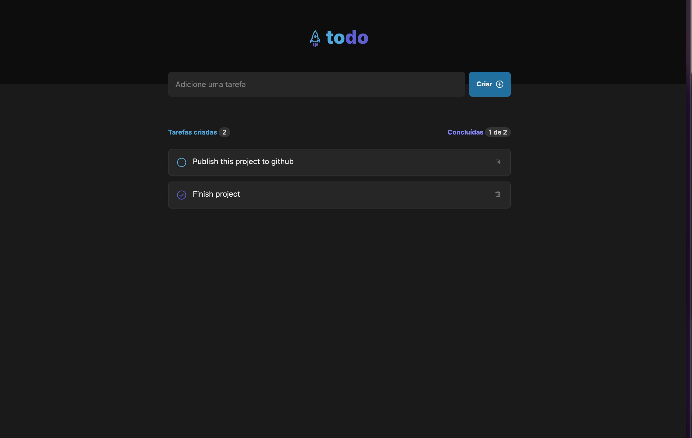

# To do list

First challenge of Ignite course

## 💻 Project

This is a simple to do list, where you can add, remove and mark tasks as completed.

<!-- add banner -->



## 🚀 Techs

- [React](https://reactjs.org/)
- [TypeScript](https://www.typescriptlang.org/)
- [Vite](https://vitejs.dev/)

## Run project

```bash
# Clone this repository
$ git clone git@github.com:eulixir/todo-list-ignite.git

# Access the project folder in your terminal
$ cd ignite-reactjs-challenge-01

# Install the dependencies
$ yarn or npm install

# Run the application in development mode
$ yarn dev or npm run dev

```

<table>
  <thead>
    <tr>
      <td valign="bottom">
        <p align="center">
          <a href="https://github.com/eulixir">
            
          </a>
        </p>
      </td>
      <td valign="bottom"><p align="center"></p></td>
    </tr>
  </thead>

  <tbody>
    <tr>
      <td><a href="https://github.com/eulixir">João Pedro Alves</a></td>
    </tr>
  </tbody>
</table>
